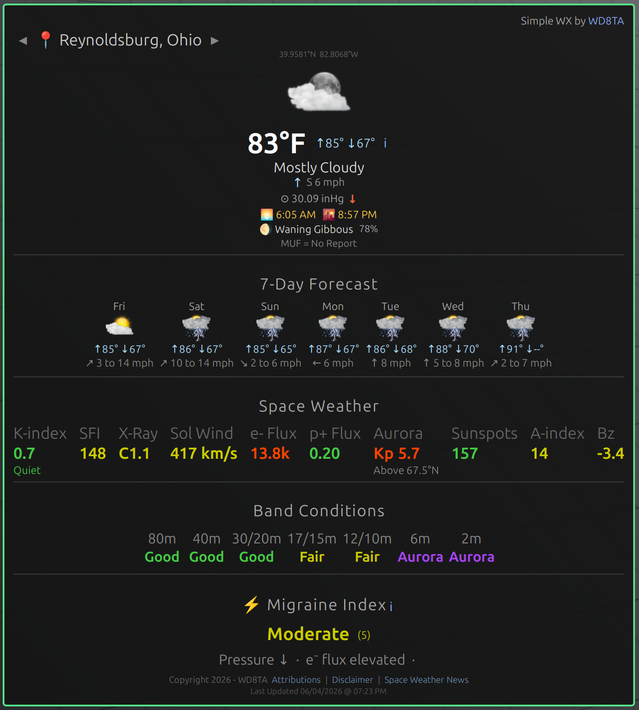

# SimpleWx
### Ham radio aware weather desklet for Linux Mint Cinnamon with space weather and migraine index

**By WD8TA** | [QRZ.COM/db/WD8TA](https://www.qrz.com/db/WD8TA)

---

> *"Because your weather desklet should know what the ionosphere is doing."*

SimpleWx is a feature-rich, ham-radio-aware weather desklet for the **Cinnamon desktop environment** (Linux Mint). It combines real-time terrestrial weather from the National Weather Service with live space weather data from NOAA's Space Weather Prediction Center — and includes an experimental personal **Migraine Index** that correlates environmental and space weather factors into a single at-a-glance health indicator.

---

## Screenshots



---

## Features

### 🌤️ Terrestrial Weather
- **Current conditions** — weather icon, temperature, condition description
- **Today's high/low** displayed alongside current temperature
- **Wind** — direction arrow (CSS/SVG-based, no asset dependency), speed and direction text
- **Barometric pressure** with real-time trend indicator (↑ rising / ↓ falling / = stable)
- **Sunrise and sunset times** — calculated mathematically from your coordinates, no API required
- **Moon phase** — emoji symbol, phase name, and illumination percentage (Meeus algorithm)
- **7-day forecast strip** — icon, high/low temps, and wind per day
- **Detailed forecast popup** — click the ℹ button for the full NWS narrative forecast

### 📡 Ham Radio Space Weather
SimpleWx displays a full suite of real-time space weather data sourced from NOAA SWPC:

| Indicator | Source | Description |
|---|---|---|
| **K-index** | NOAA SWPC | Geomagnetic activity index with color-coded storm level |
| **Geomagnetic State** | Derived | Quiet / Unsettled / Active / Storm level label |
| **SFI (F10.7)** | NOAA SWPC | Solar Flux Index — primary HF propagation health indicator |
| **X-Ray Flux** | GOES Primary | Current solar flare class (A/B/C/M/X) with color coding |
| **Solar Wind Speed** | NOAA SWPC | Current solar wind velocity in km/s |
| **Electron Flux** | GOES Primary | 79 keV channel — earliest indicator of electron environment change |
| **Proton Flux** | GOES Primary | ≥10 MeV reference channel — NOAA S-scale standard |
| **Aurora Forecast** | NOAA SWPC | Next predicted Kp with equatorward visibility boundary latitude |

### 📻 Band Conditions
Color-coded propagation quality estimates for **80m, 40m, 20m, 15m, 10m, and 6m** derived from real-time K-index and SFI data:

- 🟢 **Good** — favorable conditions
- 🟡 **Fair** — marginal conditions
- 🔴 **Poor** — degraded conditions
- 🟣 **Aurora** — aurora scatter opportunity on 6m/VHF (using forecast Kp)

### ⚡ Migraine Index *(Experimental)*
An experimental personal health indicator that combines multiple environmental and space weather factors into a single scored prediction:

**Factors considered:**
- Barometric pressure drop (mild and sharp)
- K-index elevation (active and storm levels)
- Electron flux elevation (79 keV channel)
- Proton flux elevation (≥10 MeV channel)
- Forecasted temperature swing
- High terrestrial wind speed
- New Moon and Full Moon phase windows (clinically documented migraine triggers)
- Aurora visible at user latitude

**Score → Indicator:**
| Score | Label | Color |
|---|---|---|
| 0–2 | Low | 🟢 Green |
| 3–5 | Moderate | 🟡 Yellow |
| 6–8 | Elevated | 🟠 Orange |
| 9+ | High | 🔴 Red |

A factor breakdown line shows exactly which conditions are contributing to the current score.

> ⚠️ **The Migraine Index is not a medical device.** See the full disclaimer within the desklet and in [DISCLAIMER.md](DISCLAIMER.md). Do not use this tool to make medical decisions.

### 🗺️ Multi-City Support
- **IP-based geolocation** — auto-detects your current city on startup (falls back gracefully if unavailable)
- **5 configurable favorite locations** — named locations with lat/lon, selectable from the desklet
- **◀ ▶ navigation buttons** — cycle through favorites directly on the desklet
- **📍 indicator** when showing geolocated position

### ⚙️ Settings Panel
Right-click the desklet → **Configure** to access:
- Temperature units (°F / °C)
- Weather refresh interval (10–120 minutes)
- Geolocation on/off
- Default favorite location
- Section visibility toggles (Space Weather, Band Conditions, 7-Day Forecast, Migraine Index)
- Border toggle, color picker, size, and corner radius

---

## Data Sources

All data is sourced from free, publicly available APIs — **no API keys required.**

| Source | Data | URL |
|---|---|---|
| National Weather Service | Current conditions, forecasts, pressure | api.weather.gov |
| ip-api.com | IP geolocation | ip-api.com |
| NOAA SWPC | K-index, SFI, solar wind, aurora forecast | swpc.noaa.gov |
| GOES Primary (NOAA) | X-ray flux, electron flux, proton flux | services.swpc.noaa.gov |

---

## Requirements

- **Linux Mint** with the **Cinnamon** desktop environment
- Cinnamon version 5.x or later recommended
- Internet connection for weather and space weather data
- No external dependencies — all standard GJS/Cinnamon libraries

---

## Installation

### Manual Installation

1. Clone or download this repository:
```bash
git clone https://github.com/WD8TA/simplewx.git
```

2. Copy the desklet folder to your Cinnamon desklets directory:
```bash
cp -r simplewx@wd8ta ~/.local/share/cinnamon/desklets/
```

3. Restart Cinnamon:
```
Alt+F2 → type r → press Enter
```

4. Right-click your desktop → **Add Desklets** → find **SimpleWx** → click **+**

5. Read and acknowledge the disclaimer that appears on first run.

### Folder Structure
```
simplewx@wd8ta/
├── desklet.js          — Main desklet logic
├── metadata.json       — Cinnamon desklet manifest
├── settings-schema.json — Settings panel definition
├── stylesheet.css      — Visual styling
├── config.json         — API endpoint configuration
├── attributions.json   — Asset and data attributions
├── disclaimer.json     — Full disclaimer text
└── assets/
    └── *.png           — Weather condition icons (72px)
```

---

## Weather Icons

SimpleWx uses a set of 72px PNG weather condition icons stored in the `assets/` folder. The icon naming convention is:

```
wx-[day|night]-[condition]-72.png    (time-of-day sensitive)
wx-[condition]-72.png                (condition only)
```

**Confirmed icon filenames used:**
- `wx-day-clear-72.png`
- `wx-night-clear-72.png`
- `wx-day-partly-cloudy-72.png`
- `wx-night-partly-cloudy-72.png`
- `wx-day-scattered-clouds-72.png`
- `wx-night-scattered-clouds-72.png`
- `wx-overcast-72.png`
- `wx-scattered-showers-72.png`
- `wx-showers-72.png`

SimpleWx includes a graceful fallback chain — if a specific icon file doesn't exist it falls back to a generic equivalent automatically.

---

## Configuration

### Adding Favorite Locations

1. Right-click the desklet → **Configure**
2. Enter a name, latitude, and longitude for each favorite
3. Set your **Default Favorite** (1–5) — this is used when geolocation is unavailable
4. Use the **◀ ▶** buttons on the desklet to cycle between favorites

### Finding Latitude/Longitude

For any US city: [latlong.net](https://www.latlong.net) or simply search "Your City and State latitude longitude" in any search engine.

### Migraine Index Calibration

The scoring weights are defined as constants at the top of `desklet.js` in the `MX` object:

```javascript
const MX = {
    PRESSURE_DROP_MILD:  0.03,   // inHg
    PRESSURE_DROP_SHARP: 0.10,   // inHg
    ELECTRON_ELEVATED:   100000, // 79 keV channel pfu
    PROTON_ELEVATED:     10,     // >=10 MeV pfu (NOAA S1 threshold)
    MOON_NEW_WINDOW:     1.5,    // days either side of new moon
    MOON_FULL_WINDOW:    1.5,    // days either side of full moon
    // ... and more
};
```

Adjust these values based on your personal observations over time. The defaults are reasonable starting points derived from published research and personal experience.

---

## The Migraine Index — Background

The Migraine Index is an experimental feature born from years of personal observation correlating geomagnetic storms, barometric pressure drops, and migraine occurrence. Published research supports several of the individual correlations:

- Geomagnetic activity and headache: documented in *Cephalalgia* and related journals
- Barometric pressure and migraine: well established across multiple studies
- Lunar cycle and migraine: documented in clinical literature
- Solar particle events and neurological effects: emerging research area

SimpleWx is the first tool to combine all of these factors into a single real-time instrument. The goal is personal calibration — track your migraine days against the index score over time and adjust the weights to match your individual response profile.

**This is citizen science, not clinical medicine.** See the full disclaimer.

---

## Planned Features (v10+)

- 📊 CSV/JSON daily score logging for long-term migraine correlation analysis
- 🧠 Migraine model explanation popup — plain-English description of each factor
- 📅 Click 7-day forecast cell for that day's detailed NWS narrative
- 📈 Pressure trend sparkline (mini visual graph)
- 🐙 Cinnamon Spices repository submission

---

## For Ham Radio Operators

SimpleWx was built by a ham (WD8TA, Extra class, Columbus OH) frustrated with weather desklets that didn't understand what the ionosphere was doing. The space weather section gives you everything you need to decide whether to call CQ on 20m or give up and watch TV:

- **SFI > 150** — 10m and 15m are likely open
- **K-index ≥ 4** — HF is getting rough, especially low bands
- **6m shows Aurora** — get on the radio *right now* and spin the VFO
- **X-ray class M or X** — expect HF blackout on the sunlit side

The band conditions strip gives you an instant at-a-glance answer without doing the math yourself.

---

## Known Limitations

- NWS data is US-only — international locations will not receive weather data
- Barometric pressure requires a nearby NWS observation station — some locations may show no pressure data
- IP geolocation accuracy varies — typically resolves to city level
- The Migraine Index has not been clinically validated
- Cinnamon desklet decoration is disabled system-wide when SimpleWx is installed (required for proper border rendering)

---

## Disclaimer

SimpleWx is provided as-is with no warranties. The Migraine Index is experimental, not a medical device, and must not be used to make medical decisions. See the full disclaimer by clicking **Disclaimer** in the desklet footer, or read [DISCLAIMER.md](DISCLAIMER.md).

---

## License

SimpleWx is released as **public domain** software. Use it, modify it, share it. Attribution appreciated but not required.

---

## Attributions

See [attributions.json](attributions.json) for full attribution details for weather icons and data sources.

---

## Contributing

Pull requests welcome. If you're a ham who wants to add a feature, fix a bug, or improve the band conditions algorithm — please do. Open an issue first for significant changes so we can discuss the approach.

If you find the Migraine Index useful and want to share your calibration data, open a discussion — the more data points from different people, the more interesting the patterns become.

---

## Contact

**WD8TA** — [QRZ.COM/db/WD8TA](https://www.qrz.com/db/WD8TA)

*73 de WD8TA* 📡
